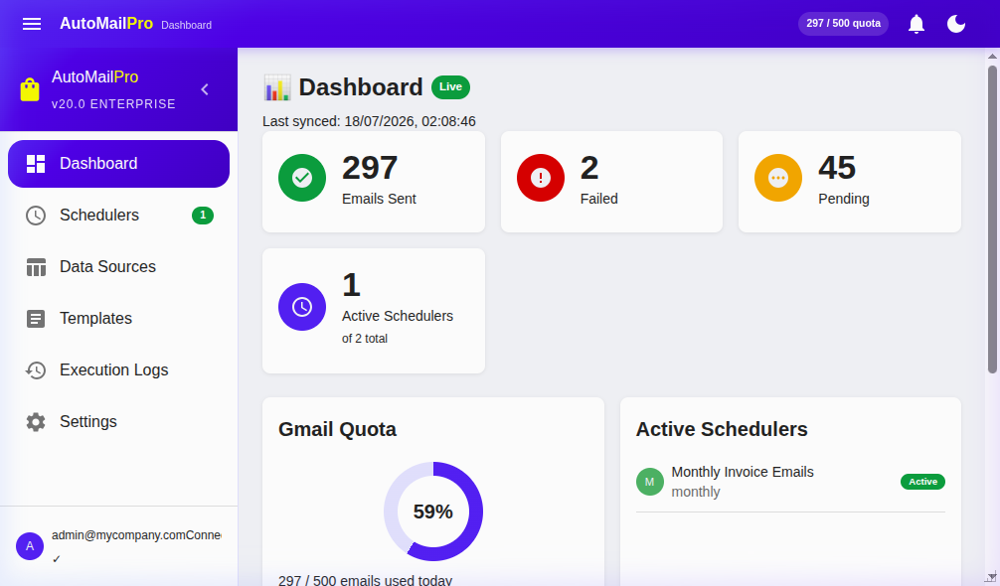
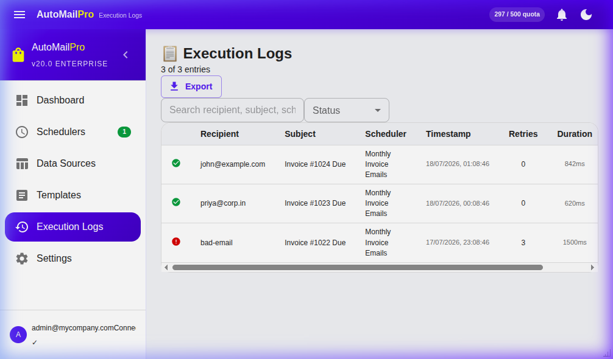
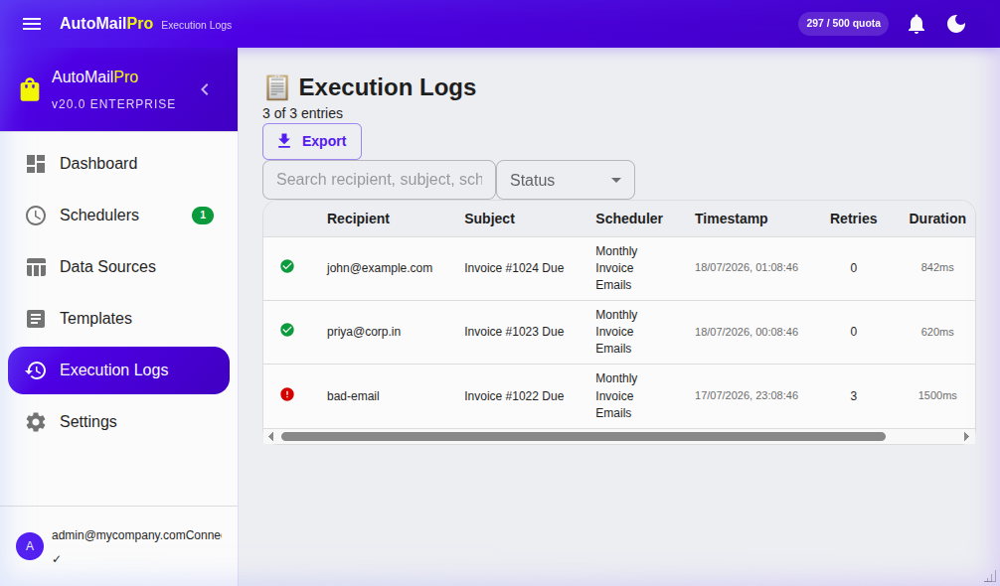
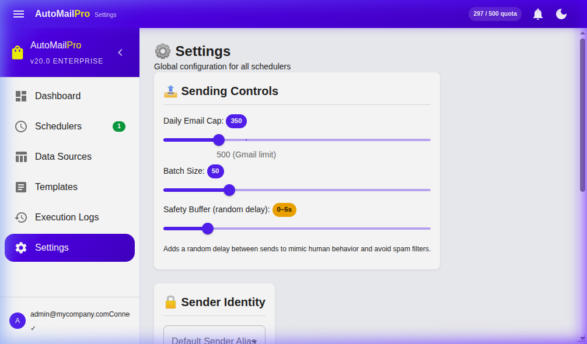
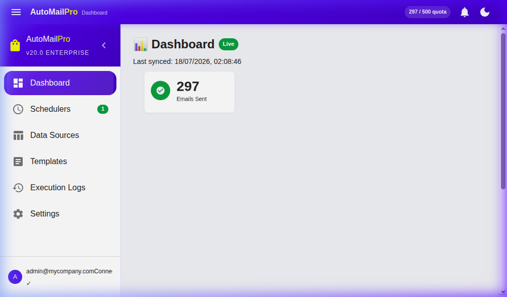

# AutoMailPro Enterprise – Business & Technical Architecture

## Interface Showcase

*Figure 1: Accessing AutoMailPro directly from the Google Sheets custom menu.*

*Figure 2: The dynamic, resizable floating dashboard displaying live quota statistics.*

*Figure 3: Active scheduling pipelines with visual indicator tags.*

*Figure 4: Real-time telemetry and error logging for all email dispatches.*

*Figure 5: Rich-text template management with variable merge tags.*

*Figure 6: Enterprise-grade configuration panel.*

> **🎥 Watch the 30-Second Demo Video**: [Click here to view the full UI walkthrough](docs/assets/demo.webm)

## Business Development & Client Utilization (MNC Level)
AutoMailPro is an enterprise-grade Google Workspace Add-on built to scale automated communication workflows directly from Google Sheets. 

### MNC Value Proposition
At the multinational corporate (MNC) level, data fragmentation and communication silos are critical bottlenecks. AutoMailPro solves this by turning any Google Sheet into a dynamic, zero-infrastructure CRM and email automation engine.
*   **Zero-Infrastructure Deployment**: Because it leverages Google Apps Script (GAS) and the Google Workspace Marketplace, IT departments do not need to provision new servers, databases, or container clusters. It runs entirely within Google's highly secure, SOC2-compliant cloud environment.
*   **Role-Based Security & OAuth**: Data never leaves the Google Workspace ecosystem. All emails are dispatched natively via `GmailApp` under the strict OAuth scopes of the active user, eliminating third-party API vulnerabilities and ensuring compliance with GDPR and corporate security mandates.
*   **Dynamic Visual Reporting**: With the automatic Table Chart snapshot feature, managers and external clients receive inline visual data representations directly in their inbox without needing to download attachments or log into external dashboards.

### Common Enterprise Use Cases
1.  **Automated Billing & Invoice Routing**: Finance departments can schedule automated arrears notifications based on dynamic due-date conditions.
2.  **HR & Onboarding Workflows**: Talent acquisition teams can deploy personalized drip campaigns for new hires, scheduling orientation materials to specific cohorts.
3.  **Supply Chain Alerts**: Operations teams can trigger instant email alerts to regional managers when inventory status columns drop below threshold levels.

## Technical Stack & Architecture
AutoMailPro abandons the traditional "spaghetti code" associated with GAS, introducing a strict, modern software architecture.

### Frontend Architecture (Client-Side)
*   **React 19 & TypeScript**: Provides a robust, strictly typed UI layer.
*   **Vite**: The build tool of choice, highly optimized to bundle the entire application into a single, minified HTML file (`vite-plugin-singlefile`), which is a strict requirement for Google Apps Script HTML Service.
*   **Material-UI (MUI v6)**: Delivers a premium, physics-based, and highly responsive user interface with dynamic rendering engines (CSS Grids, Flexbox) that effortlessly adapt to sidebar and modeless dialog resizing.
*   **Framer-Style Animations**: Implements `<Zoom>` and `<Fade>` transitions, coupled with CSS hover transformations for a tactile, modern feel.

### Backend Architecture (Server-Side Apps Script)
*   **Google Apps Script (V8 Engine)**: The serverless runtime execution environment.
*   **TypeScript (GAS Context)**: The backend is fully typed via `@types/google-apps-script`. During compilation, `tsc` converts the TS files into ESNext JavaScript modules compatible with the Apps Script global scope.
*   **Modular IIFE Pattern**: To bypass Apps Script's lack of native ES Modules, all backend services (`MailService`, `SchedulerEngine`, `TriggerService`) are encapsulated within Immediately Invoked Function Expressions (IIFEs) and ambiently declared in a targeted `tsconfig.json`. This ensures absolute modularity without namespace pollution.
*   **PropertiesService (Serverless DB)**: Acts as a lightweight NoSQL key-value store to maintain state (Schedulers, Templates, Logs) without requiring an external SQL database.
*   **Google Chart API**: Programmatically constructs `TableChart` objects in memory and exports them as `image/png` blobs for inline CID email embedding.

## Deployment Instructions
1. Build the repository locally: `npm run build`
2. Push to Google Workspace: `npx clasp push`
3. Deploy via Google Cloud Console to the Workspace Marketplace.
